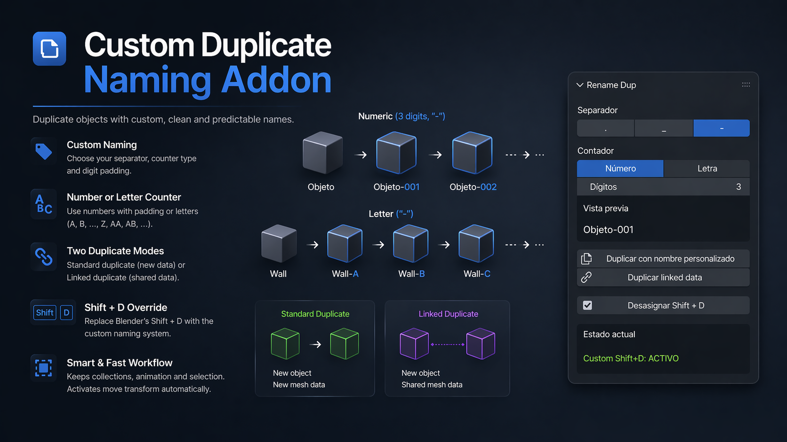

# Custom Duplicate Naming Addon

A lightweight Blender addon for duplicating objects with controlled naming conventions, custom suffix formats, and optional `Shift + D` override.

Designed to make duplicate naming predictable, clean, and consistent.

---

## 🎯 Problem This Solves

Blender’s default duplicate naming works, but it can be limiting when you want structured naming like:

```text
Rock-001
Rock-002
Rock-003
```

or

```text
Wall_A
Wall_B
Wall_C
```

Instead of Blender’s default:

```text
Cube.001
Cube.002
Cube.003
```

This addon gives control over how duplicated objects are named while preserving a fast duplication workflow.

---

## 🚀 Features

### Custom Duplicate Naming

Duplicate selected objects using configurable suffix systems.

Supports:

#### Numeric suffixes

```text
Rock-1
Rock-01
Rock-001
Rock-0001
```

Configurable digit padding:

- 1 digit  
- 2 digits  
- 3 digits  
- 4 digits

---

#### Alphabetical suffixes

```text
Wall-A
Wall-B
Wall-C
...
Wall-Z
Wall-AA
Wall-AB
```

Supports multi-letter sequences automatically.

---

### Separator Options

Choose naming separators:

- `.`
- `_`
- `-`

Examples:

```text
Tree.001
Tree_001
Tree-001
```

---

### Smart Base Name Detection

Removes existing suffixes before generating the next duplicate.

Example:

```text
Rock-001
↓ duplicate
Rock-002
```

Prevents broken names like:

```text
Rock-001-001
```

Works with:

- Numeric suffixes  
- Letter suffixes  
- Existing separators

---

### Duplicate Modes

#### Standard Duplicate

Creates:

- New object  
- New mesh data

Equivalent to an independent duplicate.

---

#### Linked Duplicate

Creates:

- New object  
- Shared mesh data

Similar to:

```text
Alt + D
```

Editing geometry affects all linked duplicates.

---

### Optional Shift + D Override

Assign or remove the addon as the `Shift + D` duplicate operator.

Allows using the custom naming system through the standard Blender shortcut.

---

### Auto Move After Duplicate

After duplication:

- New objects are selected  
- Originals are deselected  
- Move transform is activated automatically

Behaves similarly to Blender’s native duplicate workflow.

---

## 🛠 Technical Notes

### Object Mode Only

Designed for Object Mode duplication.

---

### Collection Aware

Duplicated objects stay linked to the same collections as the original.

---

### Animation Data Copy

Attempts to preserve animation/action data when present.

---

### Naming Scope

Renames:

- Object names only

Does **not** rename:

- Materials  
- Mesh datablocks  
- Collections

---

## 💻 Installation

1. Open Blender  
2. Go to:

```text
Edit → Preferences → Add-ons
```

3. Click:

```text
Install...
```

4. Select:

```text
custom_duplicate_naming_addon.zip
```

5. Enable the addon.

---

## Usage

Open the panel in:

```text
3D View → Sidebar (N) → Rename Dup
```

Available controls:

- Separator selection  
- Counter type  
- Digit padding  
- Duplicate  
- Linked Duplicate  
- Assign / Remove Shift+D

---

## Example Naming Output

Numeric:

```text
Pipe-001
Pipe-002
Pipe-003
```

Alphabetic:

```text
Panel-A
Panel-B
Panel-C
```

---

## Use Cases

Useful for:

- Environment art  
- Modular assets  
- Hard surface kits  
- Scene organization  
- Clean duplicate naming  
- General Blender workflows

---

## License

Free to use and modify.