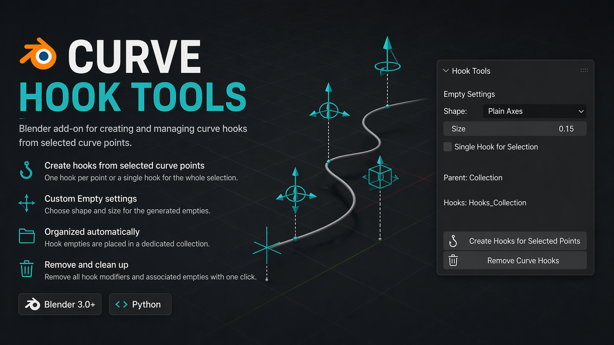

# Curve Hook Tools



Blender add-on for creating and managing curve hooks directly from selected curve points.

This tool is useful for quickly setting up controllable curve deformation using Blender Hooks and Empty objects, without manually creating each hook one by one.

---

## Features

- Create hooks from selected curve points
- Supports Bezier and non-Bezier curve points
- Option to create:
  - One hook per selected point
  - One single hook for the whole selection
- Automatically creates and organizes hook Empty objects
- Custom Empty display shape
- Custom Empty display size
- Removes hook modifiers and associated Empty objects
- Cleans up the hook collection when empty

---

## Installation

1. Download or copy the `hook_tools.py` file  
2. Open Blender  
3. Go to:

`Edit > Preferences > Add-ons`

4. Click **Install...**  
5. Select `hook_tools.py`  
6. Enable:

`Curve Hook Tools`

---

## Location

Access the tool from:

`View3D > Sidebar > Hook Tools`

Open the sidebar with:

`N`

---

## How to Use

### Create Hooks

1. Select a curve object  
2. Enter **Edit Mode**  
3. Select one or more curve points  
4. Open the **Hook Tools** panel  
5. Adjust settings if needed  
6. Click:

`Create Hooks for Selected Points`

The add-on creates hook modifiers and Empty controllers automatically.

---

## Hook Creation Modes

### One Hook Per Point

With **Single Hook for Selection** disabled:

- One hook is created for every selected point

Example:

```text
Hook_Curve-01
Hook_Curve-02
Hook_Curve-03
```

Useful for independent control.

---

### Single Hook for Selection

With **Single Hook for Selection** enabled:

- One single hook is created for all selected points.

Useful when multiple points should move together.

---

## Empty Settings

### Shape

Choose Empty display type:

```text
Plain Axes
Arrows
Single Arrow
Circle
Cube
Sphere
Cone
Image
```

---

### Size

Adjust the visual size of generated Empty controllers.

---

## Collection Organization

The add-on automatically creates a child collection:

```text
Hooks_CollectionName
```

Example:

```text
Environment
└── Hooks_Environment
```

This keeps hook controls organized.

---

## Remove Hooks

Use:

`Remove Curve Hooks`

This will:

- Remove all Hook modifiers  
- Delete associated Empty objects  
- Remove the hook collection if empty

---

## Naming

If the curve object starts with:

```text
Spline_
```

Hooks become:

```text
Hook_
```

Example:

```text
Spline_Cable
→ Hook_Cable
```

Otherwise:

```text
Hook_ObjectName
```

is used.

---

## Requirements

- Blender 3.0+
- Curve object selected
- Edit Mode for hook creation

---

## Notes

- Only works with curve objects  
- Existing non-hook modifiers are untouched  
- Original point selection is restored after execution  
- Works with Bezier and standard curve points

---

## Version

```text
1.1.0
```

---

## Author

```text
OpenAI
```