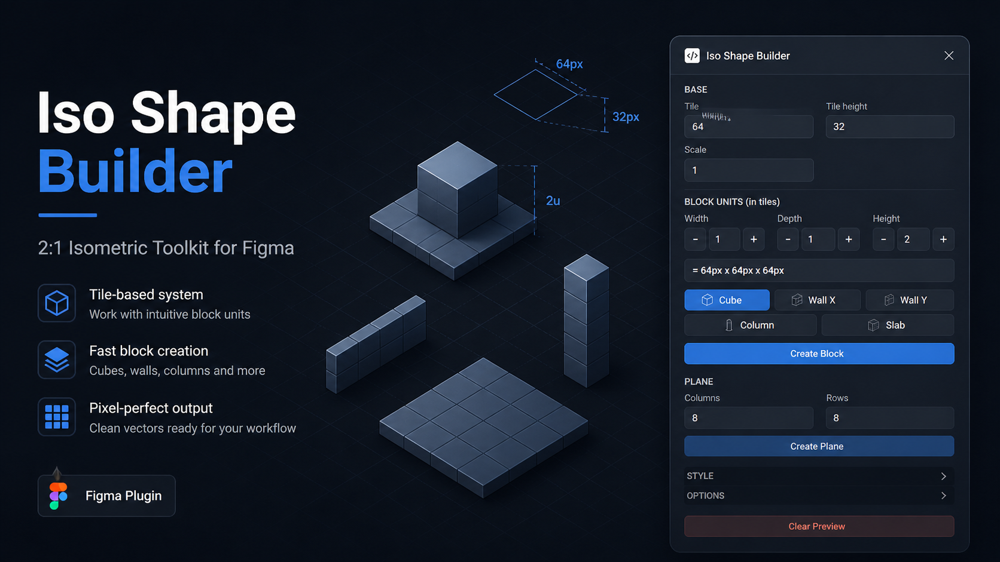

# Iso Shape Builder

Figma plugin for building clean 2:1 isometric shapes using a tile-based system.  
Designed for fast block construction, layout prototyping, and pixel-consistent workflows.

---

## Overview

Iso Shape Builder lets you create isometric geometry without relying on rotation or manual adjustments.  
All shapes are generated from coordinates, ensuring consistent proportions and predictable results.

The system is based on **tile units**, making it intuitive to construct cubes, walls, floors, and structures directly inside Figma.

---

## Core Features

- Tile-based 2:1 isometric system
- Fast creation of blocks and planes
- Room creation from four grouped isometric walls
- Pixel-consistent geometry (no arbitrary transforms)
- Faces generated as editable vectors (`Top`, `Left`, `Right`)
- Preset-driven workflow for common structures
- Clean grouping and naming conventions

---

## Block System (Key Concept)

Instead of working in pixels, shapes are defined in **tile units**:

- Width → X axis  
- Depth → Y axis  
- Height → vertical axis  

Example:

1 × 1 × 1 → Cube  
1 × 0.25 × 2 → Wall  
4 × 4 × 0 → Floor  

Internal conversion:

width  = widthTiles  × tileWidth  
depth  = depthTiles  × tileWidth  
height = heightTiles × tileHeight  

This allows you to build structures without thinking about pixel math.

---

## Included Presets

- Cube  
- Wall X  
- Wall Y  
- Column  
- Slab  

There are also direct wall actions:
- Create Iso Wall X  
- Create Iso Wall Y  
- Create Flat Wall H  
- Create Flat Wall V  

The flat wall actions create absolute screen-aligned rectangular walls, useful when a wall should not follow the isometric grid direction.

Base tile controls include a locked 2:1 ratio by default, so `tileHeight` follows `tileWidth / 2`.
The default base tile is `32 x 16`.

The block section also includes `Fill cells`: set how many base cells a piece should cover, then apply it to width or depth, or create wall pieces directly from that length.

These presets speed up common use cases like:
- walls  
- vertical structures  
- base platforms  
- modular environments  

---

## Output

The plugin generates:

- ISO_Tile_WIDTHxHEIGHT  
- ISO_Block_WIDTHxDEPTHxHEIGHT  
- ISO_Plane_COLUMNSxROWS  
- ISO_Room_WIDTHxDEPTHxHEIGHT  

Each block includes:
- Top face  
- Left face  
- Right face  

Rooms are grouped as `ISO_Room_*` and contain four movable wall groups:
- `Room_Back_Wall`
- `Room_Left_Wall`
- `Room_Right_Wall`
- `Room_Front_Wall`

All faces are **separate editable vectors** grouped logically.

---

## Usage

1. In Figma:  
   Plugins → Development → Import plugin from manifest...  

2. Select `manifest.json`  

3. Run `Iso Shape Builder`  

---

## Project Structure

- manifest.json — plugin configuration  
- code.js — geometry + Figma API logic  
- ui.html — UI interface  

---

## MVP Capabilities

- Create isometric tiles (2:1)  
- Create blocks using tile units  
- Create planes (grid-based surfaces)  
- Create rooms using width, depth, wall height, and wall thickness  
- Preset-based structure creation  
- Style controls (top / left / right / stroke)  
- Snap to pixel support  
- Create as group toggle  
- Placement in current view  

---

## Notes

- Geometry is generated directly from coordinates (no rotation hacks)  
- Designed to integrate into technical and production workflows  
- Ideal for prototyping environments, layouts, and modular systems  

---
