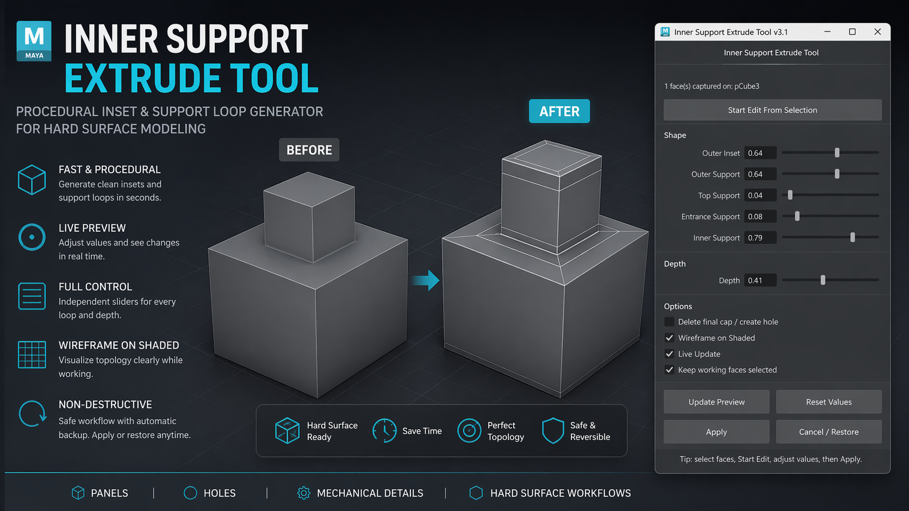

# Inner Support Extrude Tool for Maya

Interactive Maya tool for creating inset panels, hard-surface holes, and support loops through a single procedural workflow with live preview.

Designed to speed up repetitive modeling tasks such as:

- Panel insets
- Mechanical recesses
- Support loops for subdivision
- Hard-surface cut details
- Hole creation with controllable edge support

---

## Features

### Procedural Extrude Chain
Creates a structured multi-step extrusion setup from a face selection:

- Main inset creation  
- Outer support loop  
- Top support loop  
- Depth extrusion  
- Entrance support loop  
- Inner support loop  
- Optional cap deletion for open holes

---

## Live Preview Workflow

The tool uses a non-destructive preview workflow:

- Captures selected faces  
- Stores a hidden backup mesh  
- Rebuilds the extrusion result live while adjusting sliders  
- Allows applying or restoring the original mesh at any time

---

## Controls

### Shape Parameters

#### Outer Inset
Defines the primary inset size.

#### Outer Support
Controls support loop proximity near the outer border.

#### Top Support
Creates a support loop near the upper wall section.

#### Entrance Support
Adds a support loop closer to the entrance or lower transition.

#### Inner Support
Creates a support loop near the internal back edge.

#### Depth
Controls extrusion depth.

---

## Options

### Delete Final Cap / Create Hole
Removes the final face to create an open hole.

### Wireframe on Shaded
Toggles wireframe display in the viewport for easier loop inspection.

### Live Update
Updates geometry automatically while moving sliders.

### Keep Working Faces Selected
Preserves resulting working selection.

---

## Workflow

### 1. Select Faces
Select one or more polygon faces.

### 2. Start Edit
Press:

```python
Start Edit From Selection
```

This stores a backup mesh and begins preview mode.

---

### 3. Adjust Parameters
Modify:

- Inset size  
- Support loop positions  
- Depth  
- Hole option

Preview updates interactively.

---

### 4. Apply or Restore

Apply:

```python
Apply
```

Restore original mesh:

```python
Cancel / Restore
```

---

## Interface

Tool includes:

- Resizable window  
- Scrollable UI  
- Live preview controls  
- Parameter reset  
- Manual preview update button

---

## Example Use Cases

### Hard Surface Panel

```text
Outer Inset:      0.70
Outer Support:    0.94
Top Support:      0.04
Depth:           -0.30
Entrance Support: 0.03
Inner Support:    0.90
```

---

### Mechanical Hole

```text
Outer Inset:      0.65
Outer Support:    0.96
Top Support:      0.03
Depth:           -0.50
Entrance Support: 0.02
Inner Support:    0.93
Delete Cap: ON
```

---

## Installation

Copy the Python script into Maya Script Editor:

```python
# paste script
tool = InnerSupportExtrudeToolV31()
tool.show()
```

Run in Python mode.

Optional:
Save as a shelf button for quick access.

---

## Requirements

- Autodesk Maya  
- Python-enabled Script Editor  
- Polygon modeling workflow

---

## Notes

Current version is intended for:

- Group face selections  
- Hard-surface style operations  
- Procedural preview-based editing

Future extensions could support:

- Per-face mode  
- Circularize option  
- Presets  
- Shelf installation helper  
- History-based editable version

---