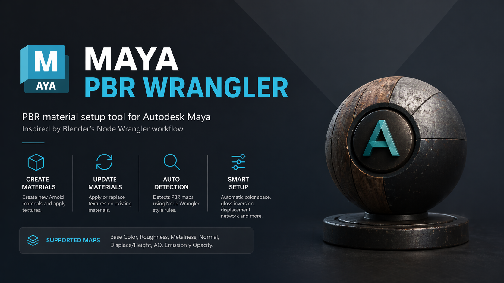

```md


# Maya PBR Wrangler

PBR material setup tool for Autodesk Maya inspired by Blender’s Node Wrangler workflow.

This tool automates creation and updating of Arnold materials from selected PBR texture sets, including automatic map detection, proper color space assignment, and shader network setup.

---

## Overview

Maya PBR Wrangler helps speed up look development by reducing repetitive manual material setup.

With a selected mesh, the tool can:

- Create and assign a new Arnold material.
- Update textures on an existing material.
- Auto-detect texture types from naming conventions.
- Connect only the maps provided.
- Configure utility nodes automatically when needed.

Designed as a lightweight utility for surfacing workflows and faster asset preparation.

---

## Features

### Material Creation
- Creates a new `aiStandardSurface`
- Assigns the material to selected meshes
- Builds texture connections automatically

### Material Update
- Reuses the object's existing material
- Replaces or adds texture maps non-destructively

### Automatic PBR Map Detection

Supports Node Wrangler–style texture name parsing:

- Removes file extensions and numeric suffixes
- Splits CamelCase names
- Parses separators:

- `_`
- `.`
- `-`
- `#`

Matches detected tokens against supported map tags.

Supported maps:

- Base Color
- Roughness
- Metallic
- Specular
- Normal
- Bump
- Height / Displacement
- Ambient Occlusion
- Transmission
- Emission
- Alpha
- Gloss (auto inverted)
- Subsurface Color

### Automatic Technical Setup

- Color maps set to `sRGB`
- Data maps set to `Raw`
- Gloss maps inverted before roughness
- Displacement network generated automatically
- Default displacement scale initialized

---

## Installation

1. Copy:

`maya_pbr_wrangler.py`

into your Maya plug-ins folder:

```text
Documents/maya/<version>/plug-ins
```

2. Open:

`Windows > Settings/Preferences > Plug-in Manager`

3. Load:

`maya_pbr_wrangler.py`

4. Optional:

Enable `Auto Load`

The tool UI will launch when loaded.

---

## Usage

### Create New Material

1. Select one or more meshes

2. Launch the tool

3. Click:

`Create Arnold Material and Apply Textures`

4. Choose the texture set

The tool creates a new shader and connects detected maps automatically.

---

### Update Existing Material

1. Select a mesh with an assigned material

2. Click:

`Apply/Replace Textures on Existing Material`

3. Select texture files

Only detected maps are updated.

---

## Example Naming Convention

Recommended names:

```text
wood_basecolor.png
wood_roughness.png
wood_metallic.png
wood_normal.png
wood_height.exr
wood_ao.png
```

Detection priority:

1. Displacement  
2. Base Color  
3. Subsurface Color  
4. Metallic  
5. Specular  
6. Roughness  
7. Gloss  
8. Normal  
9. Bump  
10. Transmission  
11. Emission  
12. Alpha  
13. Ambient Occlusion

If a name is ambiguous, the first valid match in this order is used.

---

## Requirements

- Autodesk Maya
- Arnold for Maya (`mtoa`)

---

## Notes

- Only provided maps are connected
- Missing maps are ignored safely
- Existing materials can be updated without rebuilding
- Intended for faster PBR setup, not full lookdev replacement

---

## Use Cases

Useful for:

- Asset surfacing
- Prop texturing workflows
- Lookdev setup
- Batch PBR assignment
- Technical art utilities
- Faster shader prototyping

---
```