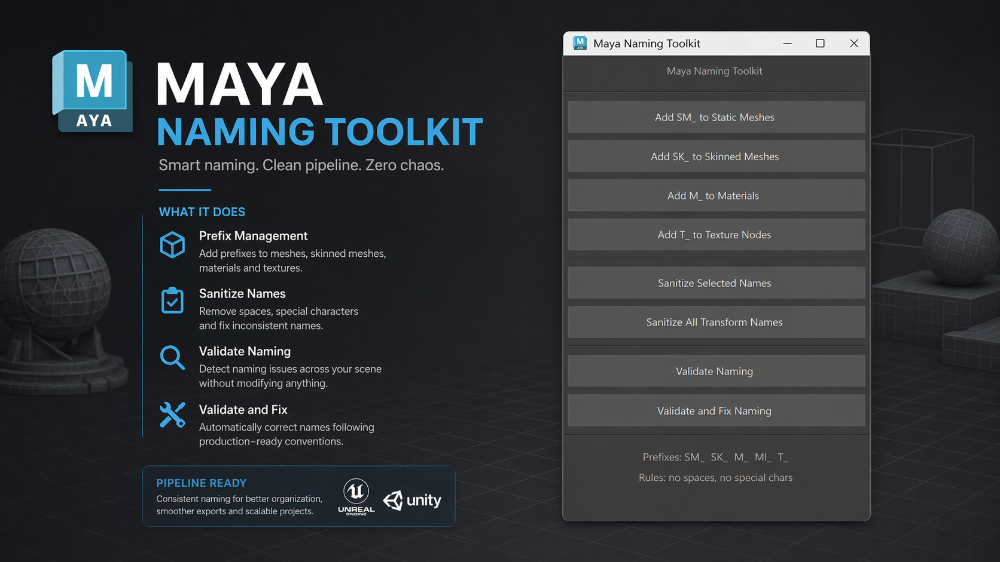

# Maya Naming Toolkit v1.0

A procedural utility written in **MEL (Maya Embedded Language)** designed to automate naming conventions inside Autodesk Maya using production-oriented prefix systems commonly used in game art pipelines.

## 🎯 Problem This Solves (Production Context)

In scalable productions, inconsistent naming causes broken references, export errors, duplicated assets, and pipeline automation failures. Naming is not cosmetic — it is functional metadata.

Modelers and Technical Artists often lose time manually renaming meshes, materials, texture nodes, or auditing scenes for naming errors before export.

**This tool reduces repetitive naming cleanup and validation to one-click operations.**

It helps enforce consistent conventions directly inside Maya before assets move downstream to engines like Unreal, lookdev, rigging, or automated export pipelines.

---

## 🚀 Main Features

### Prefix Assignment Tools
Automatic prefixing based on asset type:

- `SM_` Static Meshes  
- `SK_` Skinned Meshes  
- `M_` Materials  
- `MI_` Material Instances support  
- `T_` Texture File Nodes

Examples:

```text
Chair → SM_Chair
CharacterBody → SK_CharacterBody
Metal → M_Metal
Wall_Brick → T_Wall_Brick
```

---

### Naming Sanitization
Automatic cleanup tools for invalid names:

- Converts spaces to underscores  
- Converts dashes to underscores  
- Converts periods to underscores  
- Removes accented characters  
- Cleans selected objects or entire scene transforms

Example:

```text
Mesa nueva-final.01
↓
Mesa_nueva_final_01
```

---

### Naming Validation
Audit mode checks:

- Missing mesh prefixes  
- Missing skinned mesh prefixes  
- Missing material prefixes  
- Missing texture node prefixes  

Reports incorrect names without modifying them.

Default Maya materials are ignored:

- lambert1  
- particleCloud1  
- standardSurface1  
- openPBR_shader1

---

### Validate and Fix
Validation with automated correction.

Detects invalid naming and renames assets automatically using toolkit conventions while preserving readable base names.

---

## 🛠 Technical Design Notes

This tool was designed around several production concerns:

### 1. Prefix Logic Separation
Static meshes and skinned meshes are validated differently by detecting skinCluster history rather than relying on manual categorization.

---

### 2. Non-Destructive Validation
Validation does not modify names by default.

Potential backup or version naming such as:

```text
SM_Chair_v2_backup
```

is intentionally left untouched for manual review.

---

### 3. Safe Default Material Handling
Built-in Maya materials are excluded from checks and correction to avoid false errors or protected-node rename failures.

---

### 4. Intermediate Shape Filtering
Intermediate shapes are ignored to prevent false positives during validation.

---

### 5. Modular Architecture
The tool is separated into isolated procedures:

- Prefix Assignment  
- Sanitization  
- Validation  
- Auto-Fix  
- UI

This makes the script scalable for future additions like:

- GRP_ hierarchy naming  
- JNT_ joint naming  
- CTRL_ rig controller naming  
- Export naming presets  
- Naming lint reports

---

## 💻 Installation and Usage

1. Open Autodesk Maya.
2. Open **Script Editor**.
3. Paste the contents of `MayaNamingToolkit.mel` into a MEL tab.
4. Execute the script.
5. The **Maya Naming Toolkit** window will appear.
6. Optionally drag the script to a Shelf button for permanent access.

---

## Available Buttons

- Add SM_ to Static Meshes  
- Add SK_ to Skinned Meshes  
- Add M_ to Materials  
- Add T_ to Texture Nodes  
- Sanitize Selected Names  
- Sanitize All Transform Names  
- Validate Naming  
- Validate and Fix Naming  

---

## Naming Convention Structure

Standard format:

```text
Prefix_BaseName_Suffix
```

Example:

```text
SM_Chair_Wood_Oak
```

---

## Pipeline Notes

Recommended for pipelines targeting:

- Autodesk Maya
- Unreal Engine
- Game Asset Production
- Technical Art workflows
- Export prep / naming compliance

---

## License

Free to use and modify.